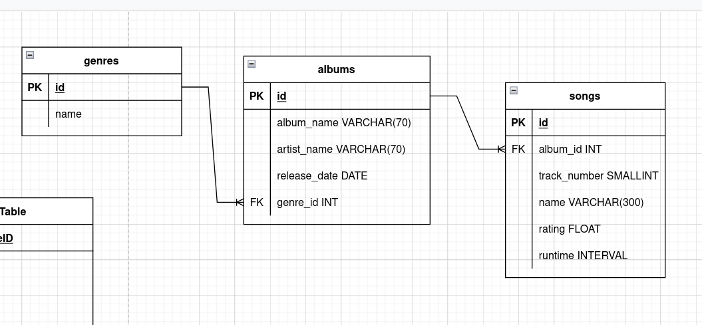
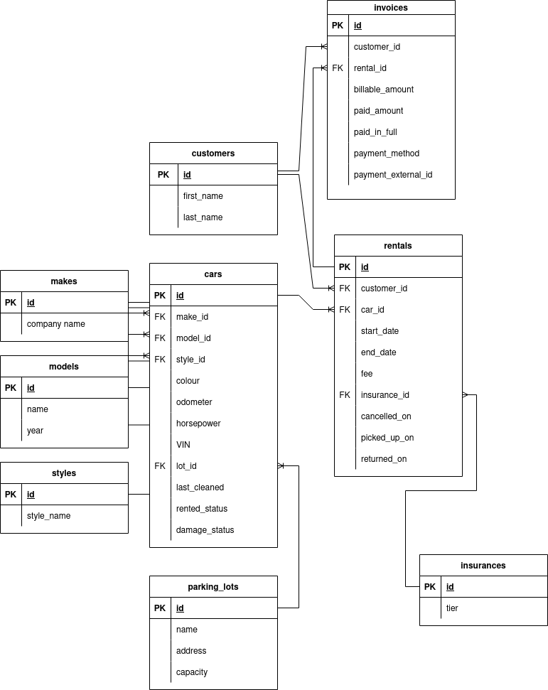

# Database Design

## Resources

 - Code Repo: https://github.com/idbentley/lighthouse-lectures/tree/main/flex-w11d2-full-w5d2-database-design
 - Video Link: https://vimeo.com/697115445/1da315a2b2

### Primary Keys

 - The unique identifier for a particular record within a table (UNIQUE)
 - A primary key can never be null (NOT NULL)
 - Usually a `BIGINT` sometimes `INTEGER`
 - Primary Keys and Foreign Keys MUST BE THE SAME DATA TYPE

### Naming Conventions

- Table and field names are written in `snake_case`
- Table names are always pluralized
- The primary key for each table will simply be called `id`
- A foreign key is made up of the singular of the primary keys table and the suffix `_id` (eg. `user_id` is the foreign key for the `id` field in the `users` table)

### Data Types

- Each field in a table **must** have a data type defined for it
- Important to choose the smallest useful datatype for a column
- Each record in a table has a fixed size determined by the data types of each column
- The data type tells the database how much room to set aside to store the value _and_ allows the database to perform type validation on data before insertion (to protect the data integrity of the table)
- Choosing the perfect data type is less of a concern nowadays because memory is now comparably cheap

### Relationship Types

- **One-to-One**: One record in the first table is related to one (and only one) record in the second table
- **One-to-Many**: One record in the first table is related to one or more records in the second table
- **Many-to-Many**: One or more records in the first table are related to one or more records in the second table

### Design Concepts

- Make fields required based on the records state upon initial creation (remember that additional data can be added to a record after it has been created)
- Intelligent default values can be set for fields (such as the current timestamp for a `created_on` field)
- Don't use calculated fields (a field that can be derived from one or more other fields, such as `full_name` is a combination of `first_name` and `last_name`)
- Pull repeated values out to their own table and make reference to them with a foreign key
- Try not to delete anything (use a boolean flag instead to mark a record as active or inactive)
- Consider using a `type` field instead of using two (or more) tables to store very similar data (eg. create an `orders` table with an `order_type` field instead of a `purchase_orders` and a `sales_orders` table)luralize table names: `authors`
 - Always call your primary keys: `id`
 - Foreign keys are made from the table name singularized plus `_id`:
     - A foreign key referencing the `authors` table: `author_id`
     - A foreign key referencing the `books` table: `book_id`
     - A foreign key referencing the `authors_books` table: `authors_book_id`

### Entity Relationship Diagram (ERD)

- A visual depiction of the database tables and how they are related to each other
- Extremely useful for reasoning about how the database should be structured
- Can be created using pen and paper, a whiteboard, or using an online application

### Tuesdays Songs Database

### Convert Two Spreadsheets
- [Gist with instruction](https://gist.github.com/andydlindsay/20e7305e853bad7b587f294b054cf8de)

### Student Suggestion: Car Rental System
We created an ERD for a car rental system:

### Useful Links
* [Database Normalization](https://en.wikipedia.org/wiki/Database_normalization)
* [Postgres Data Types](http://www.postgresqltutorial.com/postgresql-data-types/)
* [Relationship Types](http://etutorials.org/SQL/Database+design+for+mere+mortals/Part+II+The+Design+Process/Chapter+10.+Table+Relationships/Types+of+Relationships/)
* [draw.io (online ERD)](https://www.draw.io/)
