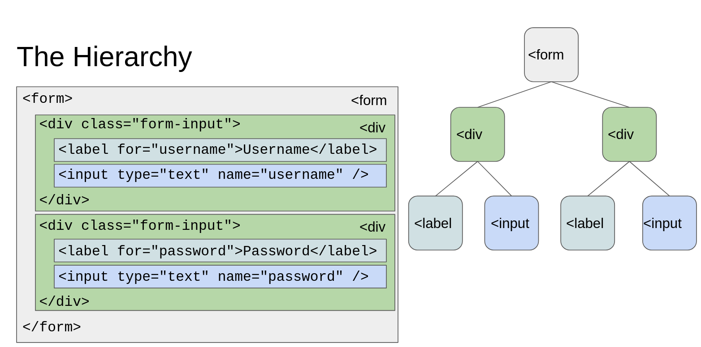

# W04D02 - Client-side JS and jQuery

## Resources
 - Video: https://vimeo.com/683497071/2c5f67d844
 - Repo: https://github.com/idbentley/lighthouse-lectures/tree/main/flex-w8d2-full-w4d2-client-side-js-jquery

## The Browser
 - The Browser is a lot like an Operating System
 - The Browser has a JavaScript Runtime Environment
 - The Browser has an HTML rendering and interaction Engine
 - The Browser can make HTTP requests
 - The Browser can style rendered pages based on CSS styles

### The **D**ocument **O**bject **M**odel
- The DOM is an Object Oriented Interface to a given webpage
- Our HTML is transformed into a hierarchical `tree` data structure that we can interact with _like regular JS objects_
- Each HTML object becomes a node in the tree with _parents_, _children_, _siblings_, etc.

- eg. The browser turns your HTML into the DOM

```html
<form>
  <div class="form-input">
    <label for="username">Username</label>
    <input type="text" name="username" />
  </div>
  <div class="form-input">
    <label for="password">Password</label>
    <input type="text" name="password" />
  </div>
</form>
```



### Object Oriented Interface

 Since the DOM provides a native JS interface, we can use it for all kinds of things:
  - Retrieve the contents of an `<input />` tag
  - Change the contents of any tag
  - Change the style of any elements
  - Add or remove elements to the page
  - Handle user interaction events
  

### Global Browser Objects
- **`window` object**
  - Represents the window that holds the DOM object
  - Each tab in a browser is a _window_ with its own `window` object
  - Contains (among other things) information about the size of the window and screen
- **`document` object**
  - A singleton object that represents the DOM
  - Provides many useful functions!


### DOM Events
- An event is a notification that some action has occurred (eg. a button is clicked, the mouse pointer is moved, a key is pressed)
- We can register `callbacks` as event handlers for specific events.

```js
// we can use anonymous functions...
document
  .querySelector('button')
  .addEventListener('click', (event) => {
  // do something
  });
```

- There are a *lot* of [DOM events](https://developer.mozilla.org/en-US/docs/Web/Events)
- Each event is represented by an `Event` object which is passed as the argument to the callback function
- The `Event` object contains useful information about the specific event that occurred

```js
// console.log the mouse x and y coordinates whenever the body is clicked
const clickHandler = function (event) {
  console.log(event.clientX, event.clientY);
};
document
  .querySelector('body')
  .addEventListener('click', clickHandler);

// we can also remove event handlers using a similar API
document
  .querySelector('body')
  .removeEventListener('click', clickHandler);
```

### jQuery
- A JavaScript library that provides a simple API for DOM manipulation, event handling, and AJAX requests
- Can be referenced with `jQuery` or the `$`
- Typically brought into a project using a **C**ontent **D**elivery **N**etwork or **CDN**
- **CDN**s store code and other files that can be brought into our projects as the browser loads our page

```html
<script src="https://code.jquery.com/jquery-3.4.1.js"></script>
```

- Uses CSS selectors for finding elements in the DOM

```js
// html element
$('h1');
// class
$('.bold');
// id
$('#login-form');
// nested element
$('#login-form input');
```

### Creating Elements with jQuery
- We can use the same jQuery interface to create DOM elements by passing in the opening tag of an HTML element

```js
const newDiv = $('<div>');
const newImg = $('');

// note the greater than and less than
$('img') !== $('');
```

- We can add attributes, event listeners, and even child elements to our created elements and then append to somewhere in the DOM

```js
// create a new image and give it a src attribute
const newImg = $('').attr('src', '/path/to/image.png');

// append the new image to the body element
$('body').append(newImg);
```

### Event Handling with jQuery
- We can also easily attach event listeners to DOM events using jQuery

```js
// When the login form submits
$(‘form#login-form’).on(“submit”, e => {});
// When the login form submits
$(‘form#login-form’).submit(e => {});

// When the button is clicked
$(‘.button’).on(“click”, e => {}); 
// When the button is clicked
$(‘.button’).click(e => {});
```

### Document Ready
* The browser will try to execute your code as soon as it can
* The document may not be done loading, the DOM may not be set up
* jQuery provides a mechanism to provide a callback that will be called when the document is ready!

```js
$(document).ready(() => {
  // this callback runs once the document is "ready"
  console.log('ready');
});

// or
$(() => {
  // passing a callback to jQuery is a shorthand for $(document).ready()
  console.log('ready');
});
```

### Useful Links
- [MDN: The DOM](https://developer.mozilla.org/en-US/docs/Web/API/Document_Object_Model/Introduction)
- [W3C DOM Standard](https://www.w3.org/DOM/)
- [MDN: Browser Events](https://developer.mozilla.org/en-US/docs/Web/Events)
- [What is the `$` in DevTools?](https://thewebivore.com/exactly-wth-is-up-with-in-devtools/)
- [jQuery Docs](https://jquery.com/)
